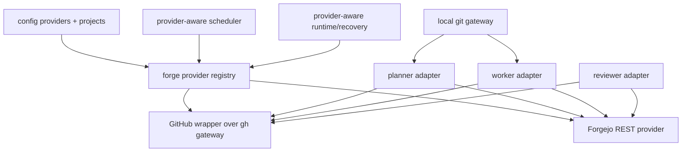

# Design

## Research

### Existing System

- Forge operations are concentrated in the GitHub gateway and are implemented with `gh` commands/API calls, including PR listing, review-request GraphQL search, PR view, REST-like `gh api`, checks, and merge-watch data. Source: `internal/infra/github/gateway.go:666-678,680-714,1365-1418,1425-1466`.
- GitHub discovery snapshots are a concrete `*DiscoverySnapshot` optimization attached to context and backed by the GitHub gateway; open PR and review-request reads can fall back to raw GitHub queries. Source: `internal/infra/github/discovery_snapshot.go:51-58,61-74,76-99`.
- Runtime startup currently constructs one global `githubGateway`, passes it into project sync, scheduler handlers, network manager, recovery, and deferred reviewer recovery. Source: `internal/runtime/runtime.go:542-588,609-623,642-704`.
- The default scheduler input is GitHub-shaped: it stores `GitHubGateway *githubinfra.Gateway`, imports `internal/infra/github`, and has a snapshotter interface typed with GitHub capture input. Source: `internal/runtime/scheduler.go:21-23,64-66,76-98`.
- Project registration currently detects GitHub repo identity when no repo is provided and stores the bare repo in project metadata. Source: `internal/projects/service.go:28-35,88-97,167-178,195-198`.
- `ProjectRefConfig` has no provider or repo field today; projects declare ID, name, repo path, branch, network, webhook, and role overrides. Source: `internal/config/types.go:508-518`.
- Reviewer/fixer defaults are GitHub-shaped: reviewer requires review requests by default, disables self-review, publishes single native reviews with approve/request-changes events, and fixer auto-discovery defaults on. Source: `internal/config/defaults.go:209-245,255-265`.
- Reviewer discovery falls back to match-all open PR discovery when no labels are configured and review-request discovery is not active. Source: `internal/reviewer/runner.go:1073-1081`.

### Design Inputs

- #505 defines the MVP target as Forgejo only, with Gitea explicitly deferred; Forgejo uses the Gitea-compatible `/api/v1` surface but must be modeled as its own provider. Source: `specs/2026-06-16-forgejo-gitea-provider/spec.md:3-7,23-25`.
- #505 requires preserving existing GitHub behavior and using `git` for local repository/worktree operations while adding a provider boundary for forge operations. Source: `specs/2026-06-16-forgejo-gitea-provider/spec.md:27-34,45-52`.
- #505 names config as the authority for Forgejo provider/repo selection, keeps legacy GitHub autodetect/metadata as a bounded transitional exception, and rejects duplicate bare `repo` across active projects for the MVP. Source: `specs/2026-06-16-forgejo-gitea-provider/spec.md:90-113`.
- #505 specifies static provider capabilities with presence flags plus behavior enums; runtime version probing is out of MVP. Source: `specs/2026-06-16-forgejo-gitea-provider/spec.md:115-206`.
- #505 requires a Forgejo provider profile because existing GitHub-shaped defaults otherwise either fail validation or silently enable unsupported reviewer/fixer behavior. Source: `specs/2026-06-16-forgejo-gitea-provider/spec.md:250-288`.
- #505 requires Forgejo runtime lifecycle to avoid global GitHub gateway construction and `gh` requirements for Forgejo-only installs, including recovery, network manager, and webhook startup paths. Source: `specs/2026-06-16-forgejo-gitea-provider/spec.md:290-302`.
- #505 requires the Forgejo implementation to use REST over `net/http`, not `tea`, with typed decoding, pagination, sanitized errors, and request timeouts. Source: `specs/2026-06-16-forgejo-gitea-provider/spec.md:324-340`.
- #505 requires Forgejo planner/worker/reviewer to run without GitHub discovery snapshots; provider-neutral interfaces must not reference `DiscoverySnapshot`. Source: `specs/2026-06-16-forgejo-gitea-provider/spec.md:342-360,589-604`.

### Constraints & Dependencies

- No storage migration is planned for MVP; repo-keyed storage remains valid by rejecting duplicate bare repo values across active projects. Source: `specs/2026-06-16-forgejo-gitea-provider/spec.md:304-314`.
- Forgejo worker must use a pre-assigned current-user invariant and re-check assignment before side effects; label-only and self-assignment claims are out of scope. Source: `specs/2026-06-16-forgejo-gitea-provider/spec.md:422-440`.
- Forgejo reviewer is comment-only; native reviews, review requests, thread resolution, auto-merge, and GitHub review-ID marker logic are out of MVP. Source: `specs/2026-06-16-forgejo-gitea-provider/spec.md:442-470`.
- Forgejo webhooks are polling-only in MVP; explicit webhook modes on Forgejo projects are validation errors, while mixed GitHub webhook configs must keep working. Source: `specs/2026-06-16-forgejo-gitea-provider/spec.md:484-508`.
- Testing must include provider config/profile validation, fake Forgejo HTTP server tests, role adapter/integration tests, Forgejo-only startup without `ghPath`, and unchanged GitHub contract tests. Source: `specs/2026-06-16-forgejo-gitea-provider/spec.md:510-519`.
- Repo guidelines require authority-bearing changes to name the action authority and justify new gates/concepts; new persisted authority fields require oracle review before merge. Source: `AGENTS.md` Design guidelines.

### Key References

- `specs/2026-06-16-forgejo-gitea-provider/spec.md:523-605` — prior migration plan and acceptance criteria.
- `internal/infra/github/gateway.go:666-678,1365-1418` — GitHub `gh` gateway examples for discovery and PR detail.
- `internal/runtime/runtime.go:542-704` — global GitHub gateway lifecycle coupling.
- `internal/runtime/scheduler.go:21-98` — scheduler GitHub imports and typed gateway/snapshot inputs.
- `internal/config/defaults.go:209-265` and `internal/config/types.go:388-448,508-518` — role defaults and project/config shapes.
- `internal/projects/service.go:167-178,195-198` — GitHub repo autodetection and metadata storage.

## Design Detail

### Design Decisions

- Add `internal/forge` as the provider boundary for role-facing issue, PR, label, comment, identity, capability, and repository reference contracts. GitHub is adapted through a transitional wrapper over `internal/infra/github.Gateway`; Forgejo is implemented as a REST provider. Source: prior spec `specs/2026-06-16-forgejo-gitea-provider/spec.md:56-88,316-340`; current GitHub gateway uses `gh` at `internal/infra/github/gateway.go:666-678,1365-1418`.
- Provider/repo selection authority is config for Forgejo. Legacy GitHub keeps autodetect/metadata authority as a bounded transitional exception. Do not add persisted provider authority in the MVP. Source: `specs/2026-06-16-forgejo-gitea-provider/spec.md:90-113,304-314`; current config lacks project provider/repo at `internal/config/types.go:508-518` and current project add stores detected repo metadata at `internal/projects/service.go:167-178,195-198`.
- Reject duplicate bare `repo` across active projects for the MVP instead of migrating storage to host-qualified keys. Source: `specs/2026-06-16-forgejo-gitea-provider/spec.md:90-101,304-314`.
- Use a static provider capability table with presence booleans and behavioral enums. Runtime version probing is out of scope. Source: `specs/2026-06-16-forgejo-gitea-provider/spec.md:115-206,607-614`.
- Apply a fixed, source-aware Forgejo provider profile after hard defaults and before explicit user/env/CLI overrides; validation then rejects explicit unsupported opt-ins. Source: prior spec `specs/2026-06-16-forgejo-gitea-provider/spec.md:250-288`; GitHub-shaped defaults at `internal/config/defaults.go:209-265`; reviewer match-all path at `internal/reviewer/runner.go:1073-1081`.
- Make runtime, scheduler, recovery, network, and webhook startup provider-aware instead of constructing one global GitHub gateway. Source: `internal/runtime/runtime.go:542-704`; `internal/runtime/scheduler.go:21-98`; prior spec `specs/2026-06-16-forgejo-gitea-provider/spec.md:290-302,342-360`.
- Keep GitHub discovery snapshots GitHub-only; Forgejo role adapters use direct provider calls and provider-neutral interfaces must not reference `*githubinfra.DiscoverySnapshot`. Source: `internal/infra/github/discovery_snapshot.go:51-99`; prior spec `specs/2026-06-16-forgejo-gitea-provider/spec.md:342-360,597-604`.
- Forgejo worker uses the pre-assigned current-user invariant and re-checks before side effects; no self-assignment or label-only claim fallback. Source: `specs/2026-06-16-forgejo-gitea-provider/spec.md:422-440`; current worker defaults require current-user assignee at `internal/config/defaults.go:272-279`.
- Forgejo reviewer is comment-only and label-discovered; it records successful publish head SHA in existing loop/run state and accepts crash-window duplicates rather than adding durable outbox state. Source: `specs/2026-06-16-forgejo-gitea-provider/spec.md:442-470`.
- Forgejo webhooks are polling-only in this MVP; explicit Forgejo webhook modes and routed network mode fail validation, while existing GitHub webhook modes remain valid. Source: `specs/2026-06-16-forgejo-gitea-provider/spec.md:484-508`; runtime/network coupling at `internal/runtime/runtime.go:621-623,682-690`.

### System Structure

### System Procedure

1. Load config and hard defaults.
2. Normalize provider definitions and project repo bindings.
3. Resolve each project to one provider.
4. Apply Forgejo profile only for Forgejo projects where fields are default-equivalent.
5. Validate capabilities and unsupported explicit opt-ins.
6. Build provider registry keyed by provider config ID.
7. Runtime/scheduler/recovery select provider adapters per project.
8. Forgejo planner/worker/reviewer call REST-backed provider methods directly; GitHub continues through the `gh` wrapper.

### Interfaces / APIs

- `ProviderKind`: `github`, `forgejo`.
- `ProviderConfig`: ID, kind, base URL, GitHub `ghPath` compatibility, Forgejo token source.
- `RepositoryRef`: provider ID, kind, normalized base URL, bare repo.
- `Capabilities`: issue/PR/label/assignee/review/webhook presence plus claim/discovery/publish/thread strategy enums.
- Role-facing provider interfaces scoped to actual role needs: issues, pull requests, labels, comments, identity, diffs/metadata for reviewer.
- Forgejo REST client over `<baseURL>/api/v1` with typed responses, pagination, timeouts, token auth, and sanitized errors.

### Change Scope

#### Impact Areas

- Config schema/defaulting/validation/provider profile.
- Provider abstraction and GitHub/Forgejo implementations.
- Runtime composition, recovery, scheduler, network, and webhook startup.
- Planner/worker/reviewer adapters and provider-specific prompt/fetch contracts.
- Project sync/add path and duplicate repo validation.
- Fake-provider contract/integration tests and GitHub regression tests.

#### Planned File Changes

- `internal/config/*`: provider structs, project provider/repo fields, source-aware profile/default layering, validation.
- `internal/forge/*`: provider types, capabilities, registry, GitHub wrapper, Forgejo REST client.
- `internal/runtime/*`: provider-aware composition, scheduler input/adapters, recovery, webhook/network gating.
- `internal/projects/*`: config-driven Forgejo project sync and duplicate repo validation against active stored projects.
- `internal/planner/*`, `internal/worker/*`, `internal/reviewer/*`: provider-neutral interfaces, Forgejo role behavior, provider-specific prompts/fetch contracts.
- `internal/infra/github/*`: keep current gateway and contract tests; move only shared concepts behind wrappers where needed.
- `docs/configuration.md`, `skills/looper/references/config.md`: document providers and Forgejo polling-only MVP if implementation changes user-visible config.

### Edge Cases

- Generated config files that serialize defaults must not be interpreted as explicit user opt-ins over the Forgejo profile.
- Two providers pointing to the same Forgejo host with different credentials must remain distinct registry entries.
- Active stored GitHub projects omitted from current config can still collide with a new Forgejo bare repo and must block startup/sync.
- Forgejo worker must skip an issue if the current user assignment is removed after discovery but before side effects.
- Forgejo reviewer must never discover all open PRs because labels are empty and review requests are disabled.
- Mixed GitHub + Forgejo installs must not reject global GitHub webhook settings merely because Forgejo projects poll.
- Tokens and sanitized provider errors must not leak credentials into diagnostics.

### Verification Strategy

- Unit tests: config normalization, provider registry keying, duplicate repo rejection, Forgejo profile source-awareness, unsupported capability errors.
- Fake HTTP server tests: Forgejo auth, pagination, typed decoding, error bodies, labels, assignees, issues, PRs, comments, identity.
- Runtime tests: Forgejo-only startup/recovery with no `ghPath`; mixed GitHub webhook + Forgejo polling config.
- Role/integration tests: Forgejo planner spec PR, worker pre-assigned issue PR creation, reviewer comment-only publish idempotency after local record.
- Prompt-contract tests: Forgejo prompts do not include `gh pr view`, `gh pr diff`, `gh api`, review-request, or native-review instructions.
- Regression commands: `go test ./...`, `go vet ./...`, `go build ./...`.
