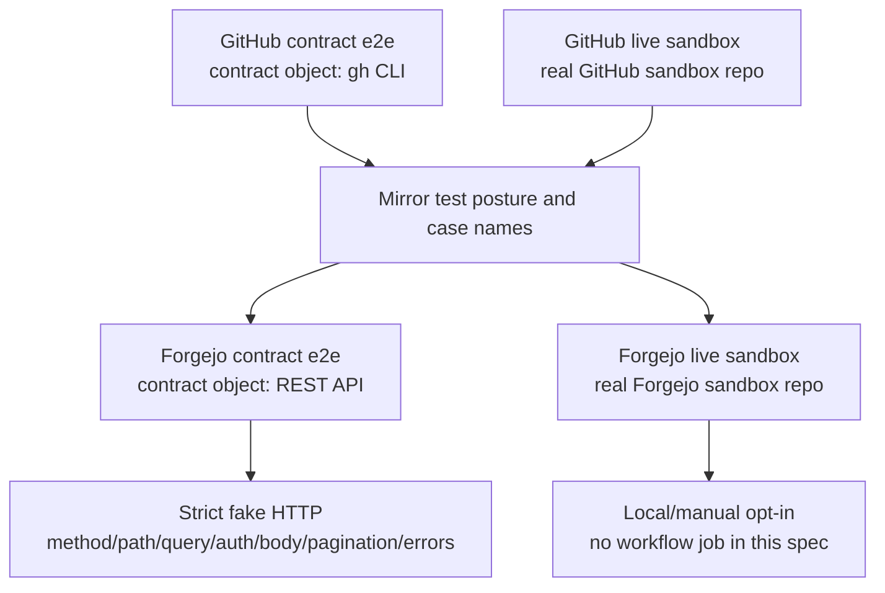

# Design

## Research

### Existing System

- GitHub contract E2E is a separate `internal/e2e/githubcontract` package. It builds e2e binaries through the shared harness, uses `harness.NewFakeGH`, writes strict fake state, exercises the GitHub gateway, and asserts supported `gh --json` fields and API/GraphQL routes through the fake invocation log. Source: `internal/e2e/githubcontract/contract_test.go:21-83,155-183`.
- GitHub live sandbox E2E is env-gated inside `internal/e2e`: `LOOPER_E2E_GITHUB=1`, `LOOPER_E2E_SANDBOX_REPO`, and `LOOPER_E2E_GITHUB_TOKEN`. When enabled, missing repo/token is a test failure rather than a fallback. Source: `internal/e2e/github_sandbox_test.go:21-27,235-259`.
- The live GitHub sandbox creates real Issues/PRs, runs `looperd` against temp HOME/config and fake-agent binaries, validates terminal run state, then cleans up created PRs/issues. Source: `internal/e2e/github_sandbox_test.go:56-105,107-144`.
- E2E tests share binaries built by `internal/e2e/harness`: `looper`, `looperd`, `fake-agent`, `fake-gh`, and `fake-osascript`; callers can override all paths through `LOOPER_E2E_*_PATH` env vars. Source: `internal/e2e/harness/binaries.go:14-20,48-71,82-111`.
- CI already runs a contract/invariant smoke job against `./internal/e2e` and `./internal/e2e/githubcontract`; the sandbox workflow separately runs `go test ./internal/e2e -run '^TestGitHubSandbox' -count=1` with real sandbox credentials. Source: `.github/workflows/ci.yml:147-165`; `.github/workflows/sandbox-e2e.yml:13-20,54-58`.

### Forgejo Provider Facts

- PR 505 chose the Forgejo `/api/v1` REST surface as the provider boundary. It explicitly says not to use `tea` or another forge CLI as the primary integration boundary unless a later design proves better stability than REST. Source: `specs/2026-06-16-forgejo-gitea-provider/spec.md:25-32,36-42`.
- The concrete Forgejo client decision is REST over `net/http`, with URL building from `baseUrl` plus `/api/v1`, token auth, typed JSON decoding, sanitized response errors, timeouts, pagination, and time normalization. It says not to shell out to `tea` because a CLI dependency would create another command-output contract without removing the need to understand provider API semantics. Source: `specs/2026-06-16-forgejo-gitea-provider/spec.md:324-340`.
- Forgejo's official API Usage docs say API compatibility is tied to Forgejo major versions, API access is enabled by default unless an administrator disables it, supported auth includes `Authorization: Bearer ...` and `Authorization: token ...`, pagination uses `page`/`limit` plus `Link` and `x-total-count` headers, Swagger UI is available at `/api/swagger`, and the OpenAPI document is available at `/swagger.v1.json`. Source: `https://forgejo.org/docs/latest/user/api-usage/` sections "API Usage", "Authentication", "Pagination", and "API Guide".
- Forgejo's official Access Token Scope docs say tokens require scopes, `read:issue`/`write:issue` cover issue routes including comments/attachments/milestones, `read:repository`/`write:repository` cover repository routes including pull requests, and repository-specific tokens may use only `read:repository`, `write:repository`, `read:issue`, and `write:issue`. Source: `https://forgejo.org/docs/latest/user/token-scope/` sections "Access Token Scope" and "Specific repositories".
- Forgejo and GitHub are both first-class provider kinds in the forge package; static capabilities currently make Forgejo support Issues, Pull Requests, Labels, Assignees, Comments, Identity, and Diffs, while disabling native reviews, review requests, auto-merge, and webhooks. Source: `internal/forge/types.go:11-16,48-73`.
- Forgejo uses label-based reviewer discovery, comment-only review publishing, disabled thread resolution, pre-assigned worker claims, and polling-only webhook behavior. Source: `internal/forge/types.go:25-45,68-73`.
- The Forgejo REST client requires provider id, repo, token, and absolute base URL; config construction reads the token from `provider.tokenEnv` and fails when the env var is missing. Source: `internal/forge/forgejo.go:47-98`.
- The Forgejo REST surface currently covers current user, issues, pull requests, labels, assignees, comments, diffs, compare, create PR, and update PR behavior. Source: `internal/forge/forgejo.go:109-260`; `internal/forge/forgejo_test.go:25-207`.
- Existing Forgejo contract coverage is provider-level fake HTTP server coverage, not an e2e harness package. It asserts REST paths, pagination, client-side PR label filtering, auth header shape, escaped labels, payloads, and token redaction. Source: `internal/forge/forgejo_test.go:25-207,220-240`.
- Existing Forgejo runtime coverage uses fake HTTP servers in scheduler/adapter tests for planner PR creation, worker PR creation plus reviewer label handoff, and reviewer comment-only flow. Source: `internal/runtime/scheduler_forgejo_test.go:19-72,74-147,149-260`.
- The provided live Forgejo host `https://code.powerformer.net` exposes an anonymous OpenAPI document at `/swagger.v1.json`. The document identifies itself as "Forgejo API", `swagger: "2.0"`, `basePath: "/api/v1"`, and version `14.0.2+gitea-1.22.0`; its security definitions include `AuthorizationHeaderToken` with API tokens prepended by `token `. Source: `curl -L -s https://code.powerformer.net/swagger.v1.json` on 2026-06-22.
- The provided live repository URL `https://code.powerformer.net/nettee/looper-e2e` is reachable but anonymous web access redirects to `/user/login`; anonymous `GET /api/v1/repos/nettee/looper-e2e` returns `403`. Source: `curl -I https://code.powerformer.net/nettee/looper-e2e` and `curl -I https://code.powerformer.net/api/v1/repos/nettee/looper-e2e` on 2026-06-22.

### Constraints & Dependencies

- Forgejo provider validation requires `provider.baseUrl`, `provider.tokenEnv`, explicit project provider, and explicit project repo for Forgejo projects. Source: `internal/config/validate.go:242-263,298-305`.
- The original Forgejo/Gitea provider design intentionally deferred real Forgejo sandbox E2E from the MVP and said to add it later only when contract tests are insufficient. This spec is that follow-up work. Source: `specs/2026-06-16-forgejo-gitea-provider/spec.md:510-521`.
- The existing E2E doctrine defines three layers: unit tests, contract/invariant integration tests with strict fake external boundaries, and real sandbox E2E. The middle layer is the main PR defense; real sandbox E2E validates the project's understanding of live provider behavior. Source: `specs/2026-05-12-e2e-regression-tests/spec.md:13-23,72-83`.
- GitHub sandbox workflow runs on push to `main` and `workflow_dispatch`, not normal pull-request CI, and mints a sandbox-scoped token before running live tests. Source: `.github/workflows/sandbox-e2e.yml:3-8,44-58`.
- Local PR 507/MVP materials did not cite an upstream Forgejo REST documentation URL before this research refresh; they relied on local specs/code for the `/api/v1` claim. Source: `specs/2026-06-16-forgejo-gitea-provider/spec.md:7,25,324-340`; `specs/change/20260618-forgejo-provider-mvp/design.md:18,24`.

### Key References

- GitHub contract package: `internal/e2e/githubcontract/contract_test.go`.
- GitHub live sandbox package: `internal/e2e/github_sandbox_test.go`.
- E2E shared harness: `internal/e2e/harness`.
- Forgejo provider/client: `internal/forge/types.go`, `internal/forge/forgejo.go`, `internal/forge/forgejo_test.go`.
- Forgejo runtime adapter tests: `internal/runtime/scheduler_forgejo_test.go`.
- Prior Forgejo MVP spec: `specs/change/20260618-forgejo-provider-mvp/spec.md`.
- Original Forgejo/Gitea provider design: `specs/2026-06-16-forgejo-gitea-provider/spec.md`.
- E2E regression doctrine: `specs/2026-05-12-e2e-regression-tests/spec.md`.
- Forgejo API Usage docs: `https://forgejo.org/docs/latest/user/api-usage/`.
- Forgejo Access Token Scope docs: `https://forgejo.org/docs/latest/user/token-scope/`.
- Powerformer Forgejo OpenAPI document: `https://code.powerformer.net/swagger.v1.json`.

## Design Detail

### Design Decisions

- Forgejo e2e should mirror the GitHub e2e surface as a first-class provider test posture, not only add a reduced Forgejo-only happy path. GitHub already has deterministic contract coverage and opt-in live sandbox coverage; Forgejo's capability table defines which mirrored cases can run now and which must be explicitly skipped while the MVP lacks support. Source: `internal/e2e/githubcontract/contract_test.go:21-83`; `internal/e2e/github_sandbox_test.go:21-27,56-105`; `internal/forge/types.go:68-73`.
- Mirrored Forgejo e2e cases should use an explicit run/skip state. Supported Forgejo capabilities should be implemented and enabled; copied GitHub cases that map to unsupported MVP capabilities should remain present but call `t.Skip` with the missing capability or non-goal in the message. Cases that should be supported by current Forgejo capabilities should fail rather than skip when they do not pass. Source: `internal/forge/types.go:68-73`; `specs/change/20260618-forgejo-provider-mvp/spec.md:10-32`; `specs/2026-06-16-forgejo-gitea-provider/spec.md:510-521`.
- The mirror is full-coverage first, not a hand-picked first batch. Every existing GitHub contract/live e2e case should have a Forgejo counterpart or an explicitly documented reason it has no provider meaning; enabled-vs-skipped is then derived from Forgejo capabilities and current implementation status. Source: `internal/e2e/githubcontract/contract_test.go:21-183`; `internal/e2e/github_sandbox_test.go:56-233`; `internal/forge/types.go:68-73`.
- "No Forgejo counterpart" is reserved for tests of GitHub-specific test tooling or CI mechanics rather than Looper provider behavior. Provider behavior cases get a Forgejo counterpart even when the current result is `t.Skip`; for example fixer/review-thread and dependency-gate flows are skipped while unsupported, while the fake-`gh` fixture schema self-test has no Forgejo counterpart. Source: `internal/e2e/githubcontract/contract_test.go:155-167`; `internal/e2e/github_sandbox_test.go:107-144,190-230`; `internal/e2e/dependency_gate_sandbox_test.go:42-131`; `internal/forge/types.go:68-73`.
- Forgejo dependency gate and Coordinator mirror cases should be present but skipped in this spec. Do not implement Forgejo dependency REST contract coverage yet; the current authority is the MVP capability boundary, where Coordinator/dependency-gate behavior is unsupported for Forgejo. Source: `internal/e2e/dependency_gate_sandbox_test.go:42-131`; `specs/change/20260618-forgejo-provider-mvp/spec.md:10-32`; `internal/forge/types.go:68-73`.
- Forgejo contract e2e should use the same testing idea as the current GitHub contract e2e, but change the contract object from `gh` CLI behavior to Forgejo REST API behavior. The MVP design made REST over `net/http` the production boundary and rejected `tea` because a CLI would add a command-output contract while still requiring API semantics; therefore the Forgejo equivalent to GitHub's fake-`gh` invocation contract is strict fake HTTP route/auth/payload/pagination/error behavior, not a fake Forgejo CLI. Source: `specs/2026-06-16-forgejo-gitea-provider/spec.md:324-340`; `internal/e2e/githubcontract/contract_test.go:21-83`; `internal/forge/forgejo_test.go:25-207`.
- Forgejo REST contract facts should come from explicit authorities, not from fake-server invention. Use official Forgejo API docs and the target instance's OpenAPI document first, MVP capabilities second to decide Looper's tested surface, and live sandbox observations only as drift evidence; current Looper code is an inventory of routes to cover, not the API authority. Source: `https://forgejo.org/docs/latest/user/api-usage/`; `https://forgejo.org/docs/latest/user/token-scope/`; `https://code.powerformer.net/swagger.v1.json`; `internal/forge/forgejo.go:109-260`.
- Forgejo live e2e should copy the GitHub sandbox e2e posture: it runs against a real provider using a dedicated remote test repository, with run-specific titles/branches and cleanup. "Sandbox" means an isolated real provider repository, not a local fake or local filesystem sandbox. This spec should add a local/manual live Forgejo entrypoint, not a GitHub Actions workflow job; CI should initially cover only deterministic contract/invariant Forgejo coverage. Source: `internal/e2e/github_sandbox_test.go:21-27,56-105,235-259`; `.github/workflows/sandbox-e2e.yml:13-20,54-58`.
- Live e2e environment variables should be provider-specific going forward. Add `LOOPER_E2E_GITHUB_SANDBOX_REPO` while keeping the existing `LOOPER_E2E_SANDBOX_REPO` as a compatibility alias for GitHub; all Forgejo live variables should use the `LOOPER_E2E_FORGEJO_` prefix. Source: `internal/e2e/github_sandbox_test.go:21-27,235-259`; `.github/workflows/sandbox-e2e.yml:17-20,54-58`.
- GitHub sandbox repo env compatibility should fail fast on ambiguity: `LOOPER_E2E_GITHUB_SANDBOX_REPO` is the preferred name, `LOOPER_E2E_SANDBOX_REPO` remains a fallback alias, and setting both to different values is a configuration error rather than a silent precedence choice. Source: `internal/e2e/github_sandbox_test.go:21-27,235-259`.
- Forgejo live e2e should derive its HTTPS clone/push URL from `LOOPER_E2E_FORGEJO_BASE_URL`, `LOOPER_E2E_FORGEJO_SANDBOX_REPO`, and `LOOPER_E2E_FORGEJO_TOKEN`. Do not add a clone URL override in the first version; incompatible clone/push URL assumptions should fail visibly so the contract can be revisited with evidence. Source: `internal/e2e/github_sandbox_test.go:56-105,235-259`; `specs/2026-06-16-forgejo-gitea-provider/spec.md:326-340`.
- Forgejo live e2e prerequisites should be explicit. Without `LOOPER_E2E_FORGEJO=1`, live tests skip; with it enabled, missing `LOOPER_E2E_FORGEJO_BASE_URL`, `LOOPER_E2E_FORGEJO_SANDBOX_REPO`, or `LOOPER_E2E_FORGEJO_TOKEN`, invalid `owner/repo`, failed `/api/v1/user`, or inaccessible sandbox repo are test failures. The sandbox repo must already exist; tests create and clean only run artifacts such as issues, branches, PRs, labels, and comments. Source: `internal/e2e/github_sandbox_test.go:235-259`; `specs/2026-05-12-e2e-regression-tests/spec.md:23,72-83`.
- Implementation should deliberately copy/mirror first, run, then classify results. Supported-case failures should be classified as MVP gap, implementation defect, test-harness gap, or observed live Forgejo behavior; details belong in `steps.md` during implementation, not in DFU. DFU remains only for explicitly deferred scope decisions, not for case-by-case failure notes. Source: `specs/change/20260622-forgejo-provider-e2e/spec.md:14-20`; `specs/change/20260622-forgejo-provider-e2e/steps.md`.

### System Structure

### Mirror Matrix

- `TestInvariantGatewayUsesSupportedGHJSONFields`: Forgejo REST-mapped counterpart for issue/PR list/view and response normalization; thread resolution part is a skipped unsupported case.
- `TestInvariantGatewayDependencyWrappersUseSupportedRoutes`: Forgejo counterpart exists but skips while Coordinator/dependency gate is unsupported.
- `TestInvariantGatewaySupportsRepoForms`: Forgejo counterpart skips because Forgejo authority is explicit `baseUrl` plus `repo`, not GitHub host-qualified repo forms.
- `TestFakeGHFixtureRejectsUnsupportedJSONField`: no Forgejo counterpart because it tests the fake GitHub CLI fixture itself.
- `TestRealGHReadOnlySmoke`: Forgejo REST-mapped read-only live smoke behind Forgejo live env.
- `TestGitHubSandboxWorkerCreatesPullRequest`: Forgejo live counterpart runs.
- `TestGitHubSandboxFixerResolvesReviewThread`: Forgejo live counterpart skips while fixer/thread resolution is unsupported.
- `TestGitHubSandboxNoDiffPathsDoNotOpenOrResolve/worker-no-diff-no-pr`: Forgejo live counterpart runs.
- `TestGitHubSandboxNoDiffPathsDoNotOpenOrResolve/fixer-no-new-commit-keeps-thread-unresolved`: Forgejo live counterpart skips while fixer/thread resolution is unsupported.
- `TestGitHubSandboxDependencyGateScenarios/*`: Forgejo counterparts skip while Coordinator/dependency gate is unsupported.

### Change Scope

Impact Areas:

- E2E tests: add Forgejo contract and live sandbox counterparts beside existing GitHub e2e.
- E2E harness: add or extract strict fake Forgejo HTTP server/state/log helpers where needed.
- Live sandbox config: add provider-specific Forgejo env vars and GitHub sandbox repo env compatibility.
- Documentation: document local/manual Forgejo live e2e prerequisites and commands if implementation changes user-facing test operation.
- GitHub Actions: no Forgejo live workflow job in this spec.

Planned File Changes:

- `internal/e2e/forgejocontract/`: new Forgejo REST contract e2e package mirroring `internal/e2e/githubcontract`.
- `internal/e2e/github_sandbox_test.go`: update GitHub sandbox repo env compatibility and add or share provider-neutral helpers only when useful.
- `internal/e2e/forgejo_sandbox_test.go`: new local/manual Forgejo live sandbox tests mirroring GitHub sandbox cases.
- `internal/e2e/dependency_gate_sandbox_test.go` or a Forgejo counterpart file: add skipped Forgejo mirrors for dependency-gate live cases.
- `internal/e2e/harness/`: add reusable fake Forgejo HTTP helpers if the contract package needs shared strict request recording.
- `docs/` and `README.md`: update only if implementation exposes new commands, env vars, or local live-e2e workflow.
- `specs/change/20260622-forgejo-provider-e2e/steps.md`: record copied cases, failures, classifications, and fixes during implementation.

### Edge Cases

- Both `LOOPER_E2E_GITHUB_SANDBOX_REPO` and `LOOPER_E2E_SANDBOX_REPO` are set to different values: fail fast.
- Forgejo live e2e is enabled without base URL, sandbox repo, token, valid `owner/repo`, user access, or repo access: fail fast.
- Forgejo live e2e is not enabled: skip.
- A mirrored case maps to unsupported Forgejo capability: keep the test present and skip with the capability/non-goal in the message.
- A mirrored case maps to supported Forgejo capability but fails: do not skip; classify and fix or record the observed provider behavior in `steps.md`.
- A GitHub case tests only fake-`gh` fixture behavior or GitHub workflow token minting: no Forgejo counterpart is required.

### Verification Strategy

- Run deterministic Forgejo contract tests with `go test ./internal/e2e/forgejocontract -count=1`.
- Run non-live e2e tests relevant to Forgejo mirror behavior with `go test ./internal/e2e -run 'Forgejo|Smoke|FailsFast' -count=1` or the final implementation's narrower command.
- Run GitHub compatibility checks for sandbox env alias behavior.
- Run local/manual Forgejo live sandbox tests only when the user supplies `LOOPER_E2E_FORGEJO=1`, `LOOPER_E2E_FORGEJO_BASE_URL`, `LOOPER_E2E_FORGEJO_SANDBOX_REPO`, and `LOOPER_E2E_FORGEJO_TOKEN`.
- Run `go test ./...`, `go vet ./...`, and `go build ./...` before marking implementation complete.
