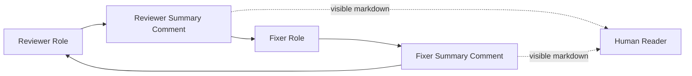

# Design

## Research

### Existing System

- Forgejo MVP explicitly supported planner/worker end-to-end and a reduced comment-only Reviewer, while leaving native Forgejo reviews, review-thread resolution, Fixer, coordinator, auto-merge, managed webhooks, routed network mode, and Gitea out of scope. Source: `specs/change/20260618-forgejo-provider-mvp/spec.md:18-33`.
- Static Forgejo capabilities currently advertise comments, diffs, labels, and pull requests, but not native reviews, review requests, auto-merge, webhooks, or thread resolution. Source: `internal/forge/types.go:68-73`.
- The existing Reviewer already has a comment-only publish path that posts a stamped top-level PR comment and fails if the agent produced no comment body. Source: `internal/reviewer/runner.go:3447-3470`.
- Existing Fixer state already models normalized fix items and a summary comment checkpoint, but GitHub's current protocol also includes resolved comment/thread state that Forgejo cannot reuse directly. Source: `internal/fixer/runner.go:125-137,598-617`.
- GitHub Fixer fix items do not carry per-feedback head SHA; they carry fix item identity, optional thread identity/fingerprint, summary, author, URL, path, and line. Source: `internal/fixer/runner.go:125-137`.
- GitHub Fixer lets the agent decide per comment fix item whether the issue is `fixed` or `declined`; Looper validates structured decisions, drift, validation, and evidence reachability rather than making a second semantic repair judgment. Source: `internal/fixer/runner.go:5571-5582,2581-2618`.
- GitHub Fixer permits live PR head to be ahead of the fix evidence commit when the evidence commit is still reachable, allowing later human/bot commits stacked on top. Source: `internal/fixer/runner.go:2507-2531`.
- GitHub Fixer's evidence reachability hard gate runs before reply/resolve remote review-state mutations, not as a general precondition for every fixer summary-like record. Source: `internal/fixer/runner.go:2507-2531,3130-3183`.
- GitHub Fixer skips summary comment publishing when there is no produced/adopted evidence, but the summary comment is best-effort and does not block GitHub resolve. Source: `internal/fixer/runner.go:3130-3183`.
- Prior Forgejo real-agent E2E used isolated runtime directories, local-only configs with token environment variables, config validation before daemon startup, bounded daemon observation until queue/run terminal state, artifact/result recording, and human-owned remote cleanup by default. Source: `specs/change/20260622-forgejo-provider-e2e/real-agent-e2e.md`.

### Design Inputs

- Forgejo top-level PR comments are issue comments and support create, list, edit, and delete. Source: `specs/change/20260630-forgejo-reviewer-fixer/research.md:69-104`.
- Forgejo COMMENT reviews and inline review comments can be created, and inline comments can be listed by review id. Source: `specs/change/20260630-forgejo-reviewer-fixer/research.md:175-205,263-290`.
- The target Forgejo instance does not expose a usable aggregate REST endpoint for all PR review comments. Source: `specs/change/20260630-forgejo-reviewer-fixer/research.md:304-309`.
- The target Forgejo instance did not expose GitHub-style parent/child reply thread fields in review comment responses. Source: `specs/change/20260630-forgejo-reviewer-fixer/research.md:312-340`.
- The target Forgejo instance did not support resolve/unresolve for review comments; OpenAPI omitted the paths, `tea pulls resolve` failed with `405`, and `resolver` stayed null. Source: `specs/change/20260630-forgejo-reviewer-fixer/research.md:349-386`.
- Pushing a new commit marks old reviews stale, but comments do not carry a separate stale field; comments retain their old commit id and diff hunk. Source: `specs/change/20260630-forgejo-reviewer-fixer/research.md:397-438`.

### Constraints & Dependencies

- The protocol must not depend on Forgejo thread resolution, because the tested instance cannot resolve review comments. Source: `specs/change/20260630-forgejo-reviewer-fixer/research.md:349-386`.
- The protocol should use top-level comments for durable state because Forgejo supports editing them and the existing Reviewer has a comment-only publish path. Source: `specs/change/20260630-forgejo-reviewer-fixer/research.md:69-104`; `internal/reviewer/runner.go:3447-3470`.
- Forgejo native review and inline comment APIs may be used as review evidence or display material, but they are not reliable as the Reviewer/Fixer lifecycle state because aggregate comments, reply threads, and resolve semantics are missing or incomplete. Source: `specs/change/20260630-forgejo-reviewer-fixer/research.md:304-386`.

### Key References

- Forgejo PR review capability probe: `specs/change/20260630-forgejo-reviewer-fixer/research.md`.
- Forgejo real-agent E2E operating notes: `specs/change/20260622-forgejo-provider-e2e/real-agent-e2e.md`.
- Forgejo provider MVP spec: `specs/change/20260618-forgejo-provider-mvp/spec.md`.
- Provider capability table: `internal/forge/types.go:68-73`.
- Reviewer comment-only publish path: `internal/reviewer/runner.go:3447-3470`.
- Fixer fix item and checkpoint shape: `internal/fixer/runner.go:125-137,598-617`.

## Design Detail

### Design Decisions

- Use Reviewer Summary as the Authority for Fixer input and Fixer Summary as Fixer output audit, both implemented as Looper-maintained top-level PR comments. Source: `specs/change/20260630-forgejo-reviewer-fixer/research.md:69-104`; `internal/reviewer/runner.go:3447-3470`.
- Treat each Reviewer Summary and Fixer Summary as a complete current-state snapshot, not an append-only event log. Fixer consumes only the current Reviewer Summary snapshot's open items and does not replay prior revisions to infer pending work. Source: `CONTEXT.md`.
- Use Reviewer-assigned, PR-local Review Item IDs as the only cross-round item identity. Fixer reports against Review Item IDs and does not infer identity from Forgejo comment IDs, line numbers, or text similarity; global uniqueness is unnecessary. Source: `specs/change/20260630-forgejo-reviewer-fixer/research.md:312-438`; `CONTEXT.md`.
- Reuse the same Review Item ID while the semantic issue is unchanged. Create a new Review Item ID only when the issue is split, merged, or materially redefined, and mark the old item `superseded` to preserve the relationship. Source: `CONTEXT.md`.
- Store the machine-readable Reviewer Summary and Fixer Summary JSON inside Looper HTML comments in the top-level PR comments. Visible Markdown may mirror the same state for humans, but Looper never parses Markdown as Authority and fails fast when the embedded JSON is missing, duplicated, invalid, or schema-incompatible. Source: `specs/change/20260630-forgejo-reviewer-fixer/research.md:69-104`; `CONTEXT.md`.
- Include `schema_version` in each summary JSON payload. MVP writes and accepts only `schema_version: 1`; missing or unknown versions fail fast instead of best-effort parsing. Source: `CONTEXT.md`.
- Maintain exactly one Reviewer Summary comment and exactly one Fixer Summary comment per PR, found by distinct Looper markers. Create the comment when absent, edit it on later rounds, and fail fast if multiple comments carry the same summary marker. Source: `specs/change/20260630-forgejo-reviewer-fixer/research.md:69-104`.
- Use only the summary-comment protocol plus no-resolve Fixer for Forgejo Reviewer/Fixer. Do not adopt native Forgejo review publishing, review-thread resolve, thread replies, or inline comment state as the lifecycle protocol unless Forgejo later supports usable resolve semantics. Source: `specs/change/20260630-forgejo-reviewer-fixer/research.md:304-386`.
- Keep existing Fixer scheduling and trigger mechanics unchanged. Existing role trigger/claim behavior decides when Fixer looks at a PR; after claim, Reviewer Summary `open` items are the only repair-work Authority. Source: `specs/change/20260618-forgejo-provider-mvp/spec.md:18-33`; `internal/config/validate.go:423`.
- Do not require Review Item feedback to be tied to the current PR head SHA. Review Items are semantic repair requests; Fixer decides `fixed`, `declined`, or `deferred` against the branch state it observes, while Looper validates decision shape, drift, and validation. Source: `internal/fixer/runner.go:125-137,5571-5582`.
- Keep Fixer per-item results to `fixed`, `declined`, and `deferred`; detailed causes such as stale evidence, tool failure, missing context, or external dependency live in the item's explanation/reason. Source: `internal/fixer/runner.go:5571-5582`; `CONTEXT.md`.
- Keep Reviewer per-item status to `open`, `resolved`, and `superseded`; only `open` items are Fixer input, and `superseded` links an old Review Item ID to the replacement item. Keep this enum separate from Fixer's `fixed`/`declined`/`deferred` result enum. Source: `CONTEXT.md`.
- Run Fixer only when the current Reviewer Summary contains at least one `open` Review Item. With zero open items, Fixer no-ops and must not scan the PR to invent work. Source: `CONTEXT.md`.
- Treat missing, duplicated, unparsable, or schema-invalid Reviewer Summary as a protocol error for Fixer. Do not fall back to Forgejo native reviews, inline comments, PR comments, or stale local checkpoints to infer repair work. Source: `CONTEXT.md`.
- Keep all historical Review Items in the Reviewer Summary machine-readable snapshot for the MVP. Fixer filters that snapshot to current `open` items; size optimization or history compaction is not part of the initial design. Source: `CONTEXT.md`.
- Use PR-local monotonically increasing `review_round_id` and `fix_round_id` values for audit and cross-summary references. Fixer Summary records `consumed_review_round_id`; Reviewer Summary may reference the latest Fixer Summary round when re-evaluating item status. Source: `CONTEXT.md`.
- Do not make evidence commit reachability an absolute precondition for publishing Forgejo Fixer Summary, because the summary does not close items or mutate review-thread state. If Fixer produces or adopts a commit, record the evidence and verify reachability where possible; if evidence is stale or unverifiable, publish a `deferred` item result with the stale/unverifiable reason instead of claiming a clean fixed result. If no new commit is produced, record the observed branch state and explanation without fabricating evidence. Source: `internal/fixer/runner.go:2507-2531,3130-3183`; `specs/change/20260630-forgejo-reviewer-fixer/spec.md`.
- Fixer does not close items. Reviewer closes, supersedes, or reopens items only by re-reviewing the then-current branch state during the next Review Round. Source: `specs/change/20260630-forgejo-reviewer-fixer/research.md:397-438`; `CONTEXT.md`.

### System Structure



- Reviewer Summary comment marker: `<!-- looper:forgejo-reviewer-summary ... -->`.
- Fixer Summary comment marker: `<!-- looper:forgejo-fixer-summary ... -->`.
- Marker content carries the complete JSON payload. The visible Markdown is rendered from the payload but is never parsed.
- The provider comment API must support list/create/edit for PR issue comments; Forgejo capability research confirmed those operations. Source: `specs/change/20260630-forgejo-reviewer-fixer/research.md:69-104`.

### Interfaces / APIs

Reviewer Summary JSON v1 shape:

```json
{
  "kind": "looper.forgejo.reviewer_summary",
  "schema_version": 1,
  "review_round_id": 3,
  "latest_fixer_round_id": 2,
  "items": [
    {
      "review_item_id": "R-001",
      "status": "open",
      "title": "Fix Forgejo summary parsing",
      "body": "The parser must fail fast when the embedded JSON is invalid.",
      "files": ["internal/reviewer/runner.go"],
      "supersedes": [],
      "superseded_by": "",
      "last_seen_round_id": 3
    }
  ]
}
```

Fixer Summary JSON v1 shape:

```json
{
  "kind": "looper.forgejo.fixer_summary",
  "schema_version": 1,
  "fix_round_id": 2,
  "consumed_review_round_id": 3,
  "observed_head_sha": "abc123",
  "evidence": {
    "head_sha": "def456",
    "reachable": "verified"
  },
  "results": [
    {
      "review_item_id": "R-001",
      "result": "fixed",
      "explanation": "Added strict embedded JSON parsing and schema validation."
    }
  ]
}
```

Schema rules:

- Reviewer Summary `status` is exactly `open`, `resolved`, or `superseded`.
- Fixer Summary `result` is exactly `fixed`, `declined`, or `deferred`.
- `schema_version` must be present and equal to `1`.
- `review_round_id` and `fix_round_id` are PR-local monotonically increasing integers.
- Review Item IDs are PR-local and stable for the same semantic issue. New IDs are only for split, merge, or material redefinition.
- Reviewer Summary retains historical items in MVP. Fixer filters to `status == "open"`.
- Summary parser must fail on missing marker JSON, duplicate marker comments, invalid JSON, unknown schema version, unknown enum values, duplicate Review Item IDs, missing result for an open item, or result for an unknown item.

### System Procedure

Reviewer round:

1. Read the existing Reviewer Summary comment if present.
2. Re-review the then-current PR branch state.
3. Reuse existing Review Item IDs for unchanged semantic issues.
4. Mark old items `resolved` when the issue is no longer present.
5. Mark old items `superseded` only when a new Review Item replaces a split, merged, or materially redefined issue.
6. Write the full Reviewer Summary v1 JSON into the fixed Reviewer Summary comment, creating the comment if absent.

Fixer round:

1. Existing trigger/claim mechanics decide that Fixer may look at the PR.
2. Read exactly one Reviewer Summary comment and parse its v1 JSON.
3. If there are zero `open` items, no-op.
4. If the summary is missing, duplicated, invalid, or unsupported, stop with a protocol error.
5. Run the agent only on the open Review Items from Reviewer Summary.
6. Require one structured result per open Review Item: `fixed`, `declined`, or `deferred`.
7. Record observed branch state and any produced/adopted evidence. If evidence is stale or unverifiable, use `deferred` plus explanation rather than claiming a clean fixed result.
8. Write the full Fixer Summary v1 JSON into the fixed Fixer Summary comment, creating the comment if absent.
9. Do not publish native Forgejo reviews, inline replies, resolve/unresolve calls, or PR metadata mutations as part of this protocol.

### Change Scope

Impact Areas:

- Forgejo Reviewer publishing: replace comment-only freeform review output with the fixed Reviewer Summary protocol.
- Forgejo Fixer input construction: consume Reviewer Summary open items instead of GitHub review thread state.
- Forgejo Fixer completion handling: publish Fixer Summary and skip GitHub resolve/reply behavior.
- Provider comment support: use top-level PR issue comment list/create/edit paths.
- Configuration validation: allow the intended Forgejo Fixer path while keeping auto-discovery, native review, review-request, auto-merge, and thread resolution disabled.
- Tests: cover parser/renderer invariants, role behavior, contract E2E, and sandbox E2E.

Planned File Changes:

- `internal/reviewer/*`: add Forgejo Reviewer Summary prompt/publish path and summary comment upsert.
- `internal/fixer/*`: add Forgejo no-resolve Fixer path, summary parser, open-item input construction, and Fixer Summary publish.
- `internal/forge/*`: expose or extend provider comment operations needed by summary upsert if not already role-accessible.
- `internal/config/*`: adjust Forgejo role validation/profile only as needed to allow this no-resolve Fixer while preserving unsupported feature rejects.
- `internal/*_test.go`: add focused parser, validation, reviewer, fixer, and contract E2E tests.
- `specs/change/20260630-forgejo-reviewer-fixer/*`: keep spec/design/plan synchronized as implementation proceeds.

### Edge Cases

- Reviewer Summary missing: Fixer stops with protocol error.
- Duplicate Reviewer Summary marker: Fixer stops with Authority conflict.
- Invalid JSON or unsupported schema version: consumer stops with protocol error.
- No open Review Items: Fixer no-ops.
- Duplicate Review Item IDs: parser rejects the summary.
- Fixer omits a result for an open item: reject agent output and do not publish a misleading Fixer Summary.
- Fixer reports an unknown Review Item ID: reject agent output.
- Evidence commit was produced but is no longer reachable or cannot be verified: publish `deferred` with the reason when possible; do not claim `fixed`.
- Reviewer disagrees with a Fixer `fixed` result: Reviewer keeps the same Review Item ID `open`.
- Issue wording/location changes but semantic issue is unchanged: Reviewer keeps the same Review Item ID.
- Issue splits/merges/materially changes: Reviewer marks old item `superseded` and links the replacement item.

### Verification Strategy

- Unit-test summary JSON extraction from HTML comments, duplicate marker detection, schema version validation, enum validation, and round ID handling.
- Unit-test Reviewer Summary item identity rules: reuse, resolved, and superseded cases.
- Unit-test Fixer input construction from Reviewer Summary: open-only filtering, no-open no-op, missing/invalid summary protocol errors, and no fallback to native comments.
- Unit-test Fixer agent-result validation: exactly one result per open item, known Review Item IDs only, `fixed`/`declined`/`deferred` only.
- Contract E2E: run an automated end-to-end contract test for the Reviewer Summary -> Fixer Summary -> Reviewer Summary loop, proving single summary-comment upsert, open-item-only Fixer input, no native review/reply/resolve/unresolve mutation, and Reviewer status updates.
- Sandbox E2E: use the dedicated Forgejo sandbox repository `https://code.powerformer.net/core/looper-sandbox` to create a real PR, run Reviewer and Fixer, verify the two fixed summary comments and no-resolve behavior on Forgejo, then clean up PR/branch/labels/comments as appropriate. Follow the real-agent E2E operating pattern from `specs/change/20260622-forgejo-provider-e2e/real-agent-e2e.md`: isolated runtime, tokenEnv-only config, config validation before startup, bounded daemon observation until queue/run terminal state, no secret logging, artifact recording, and human-owned destructive cleanup unless explicitly authorized.
- EAG documentation: record in `steps.md` exactly what EAG workflows ran, which sandbox PR/artifacts were used, what summary JSON and no-resolve behavior were observed, cleanup status, and every issue found and fixed during EAG validation.
